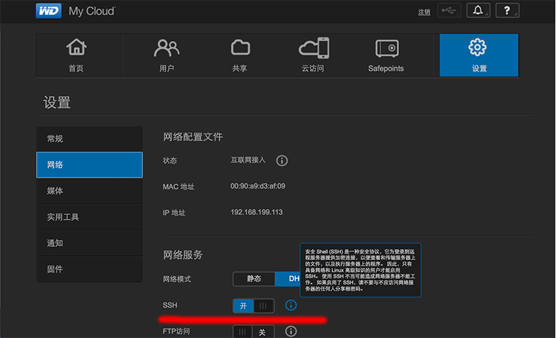
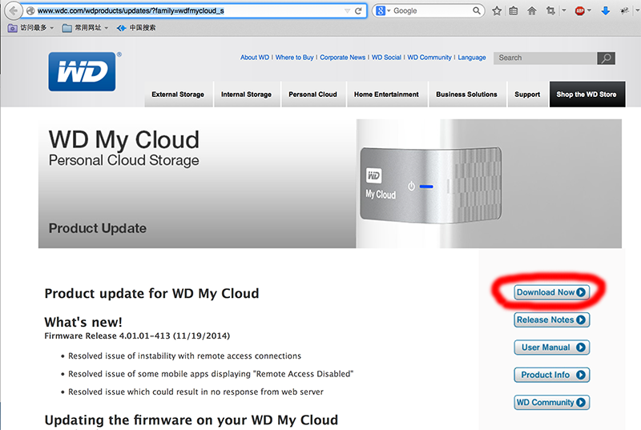

# 西部数据 My Cloud NAS 初上手之死里逃生

近日，入手了西部数据的 My Cloud NAS 4TB（固件已升级到最新, 413 版本）, 本来想安装些新应用上去（你懂得），按照网上的一些文章介绍，使用apt-get升级了Python之后，发现Dashboard进不去了。:(

开始没太在意，按照使用Ubuntu的经验（WD My Cloud 的 OS 就是 Debian 的一个特殊编译版本），做的越多，系统越诡异，后来基本上也不能从远端访问了，T_T

痛定思痛，安下心来，仔细研究了以下网上的Hack贴，最终恢复了固件，并且已上传文件无损失。

与大家分享经验如下：

## 悲剧的开始

以下所有的悲剧，源自我在Dashboard UI中打开了SSH 登陆。毕竟打开SSH之后，你才可以干些什么~~~~，嘿嘿。

你可以使用Putty、SecureCRT连接，或者 ssh 命令连接到 WD My Cloud中去了。 **注意** SSH的用户名和密码与你在 WD 中设置的完全无关，要使用 用户 root，密码 welc0me 登陆。注意那个是数字 0，不是字母 o。（话说这是不是太不安全了）

登陆到WD之后，**千万不要** 用 apt-get 安装新软件包，否则就 **悲剧** 了。原因是：WD My Cloud 在固件 **4.0** 版本之后，将 Debian 编译为 64 位的Page Size，照成标准的Linux包没法在这个版本上正确执行。更恶心的是，WD 尽然不改 etc/apt/sources.list , 所以只要你使用了 apt-get 进行了系统更新或者新软件包的安装，你就会面临变砖的风险。网上还有一些说采用ipkg安装的帖子，我自己没试过，但从原理上来说，也会有风险。变砖以后找客服有用吗? 对不起，WD 在条款中写了，自行安装软件什么的发生问题，不在保修范围之内。

## 恢复成厂家的固件

WD 在网站上提供历史固件下载，可以在这里找到，点按 “Download Now”按钮下载即可：[http://www.wdc.com/wdproducts/updates/?family=wdfmycloud_s](http://www.wdc.com/wdproducts/updates/?family=wdfmycloud_s)

下载得到最近的固件文件：sq-040001-xxx-2014xxxx.deb.zip （当前是 sq-040101-413-20141106.deb.zip） 

将下载好的zip文件解压成.deb文件，并用 SFTP 的工具（如 Filezilla， SecureFS 等）上传到 My Cloud 上去。我上传的路径是 /etc 目录下，这样系统升级之后更新时自动会把这个固件文件删掉。

使用以下命令更新固件，等待一段时间，系统会自动重启，并升级为原始固件，以下是命令执行的结果：

## 命令参考

在Linux或MAC上执行以下命令，用SSH登陆 MyCloud

    $ ssh 192.168.xxx.xxx -l root
    
    root@192.168.xxx.xxx's password: welc0me
    Linux MyCloud 3.2.26 #1 SMP Tue Jun 17 15:53:22 PDT 2014 wd-2.2-rel armv7l
    
    The programs included with the Debian GNU/Linux system are free software;
    the exact distribution terms for each program are described in the
    individual files in /usr/share/doc/*/copyright.
    
    Debian GNU/Linux comes with ABSOLUTELY NO WARRANTY, to the extent
    permitted by applicable law.

执行以下命令更新固件：

    ~# updateFirmwareFromFile.sh /etc/sq-040100-413-20141106.deb 
    
下面是执行结果，供参考。命令执行完成后，等到你的蓝灯亮起时，就又能够看到那个可恨又可爱的黑漆漆的 Dashboard 页面了。
   
    updateFirmwareFromFile.sh:11/24/14 01:16:56:: ( /etc/sq-040100-408-20141010.deb )
    updateFirmwareFromFile.sh:11/24/14 01:16:56:upgrade start: /etc/sq-040100-408-20141010.deb
    updateFirmwareFromFile.sh:11/24/14 01:16:56:check_size=
    updateFirmwareFromFile.sh:11/24/14 01:16:57:version_current=040100408
    updateFirmwareFromFile.sh:11/24/14 01:16:57:version_newfile=040100408
    updateFirmwareFromFile.sh:11/24/14 01:16:57:package_newfile=sq
    updateFirmwareFromFile.sh:11/24/14 01:16:57:master_package_name=sq
    updateFirmwareFromFile.sh:11/24/14 01:16:57:master_package_new=sq
    updateFirmwareFromFile.sh:11/24/14 01:16:57:update_container=
    [ ok ] Stopping periodic command scheduler: cron.
    [ ok ] Stopping standby monitor: monitorio.
    [ ok ] Stopping temperature monitor: monitorTemperature.
    Stopping Twonky MediaServer ... 
    [ ok ] Stopping itunes server: forked-daapd.
    [ ok ] Stopping wdphotodbmerger: wdphotodbmerger.
    [ ok ] Stopping wdmcserver: wdmcserver.
    [ ok ] Stopping Samba daemons: nmbd smbd.
    Stopping Netatalk Daemons: afpd.
    [ ok ] Stopping upnp nas device: upnpnasd.
    [ ok ] Stopping wdnotifier: wdnotifier.
    [ ok ] Stopping wdnotifier: wdnotifier.
    [ ok ] Stopping NFS kernel daemon: mountd nfsd.
    [ ok ] Unexporting directories for NFS kernel daemon....
    [ ok ] Stopping NFS common utilities:.
    updateFirmwareFromFile.sh:11/24/14 01:17:13:new_upgrade_version=2
    updateFirmwareFromFile.sh:11/24/14 01:17:13:current_upgrade_version=2
    `/tmp/tmp.vc6c0yWxz5/upgrade-version' -> `/CacheVolume/upgrade/upgrade-version'
    updateFirmwareFromFile.sh:11/24/14 01:17:13:Newer upgrade scripts in update package, use normal update method
    (Reading database ... dpkg: warning: files list file for package 'libxau6:armhf' missing; assuming package has no files currently installed
    dpkg: warning: files list file for package 'libssh2-1:armhf' missing; assuming package has no files currently installed
    dpkg: warning: files list file for package 'liblockfile1:armhf' missing; assuming package has no files currently installed
    dpkg: warning: files list file for package 'libkrb5-3:armhf' missing; assuming package has no files currently installed
    dpkg: warning: files list file for package 'libwrap0:armhf' missing; assuming package has no files currently installed
    dpkg: warning: files list file for package 'libtagc0:armhf' missing; assuming package has no files currently installed
    dpkg: warning: files list file for package 'libapr1:armhf' missing; assuming package has no files currently installed
    dpkg: warning: files list file for package 'libcap2:armhf' missing; assuming package has no files currently installed
    dpkg: warning: files list file for package 'libglib2.0-0:armhf' missing; assuming package has no files currently installed
    dpkg: warning: files list file for package 'libgphoto2-port0:armhf' missing; assuming package has no files currently installed
    dpkg: warning: files list file for package 'libpng12-0:armhf' missing; assuming package has no files currently installed
    dpkg: warning: files list file for package 'libtalloc2:armhf' missing; assuming package has no files currently installed
    dpkg: warning: files list file for package 'libevent-2.0-5:armhf' missing; assuming package has no files currently installed
    dpkg: warning: files list file for package 'libedit2:armhf' missing; assuming package has no files currently installed
    dpkg: warning: files list file for package 'libldap-2.4-2:armhf' missing; assuming package has no files currently installed
    dpkg: warning: files list file for package 'libavahi-client3:armhf' missing; assuming package has no files currently installed
    dpkg: warning: files list file for package 'libgphoto2-2:armhf' missing; assuming package has no files currently installed
    dpkg: warning: files list file for package 'libtag1c2a:armhf' missing; assuming package has no files currently installed
    dpkg: warning: files list file for package 'liblua5.1-0:armhf' missing; assuming package has no files currently installed
    dpkg: warning: files list file for package 'libpkcs11-helper1:armhf' missing; assuming package has no files currently installed
    dpkg: warning: files list file for package 'libpcre3:armhf' missing; assuming package has no files currently installed
    dpkg: warning: files list file for package 'libdb5.3:armhf' missing; assuming package has no files currently installed
    dpkg: warning: files list file for package 'libavahi-common3:armhf' missing; assuming package has no files currently installed
    dpkg: warning: files list file for package 'libsensors4:armhf' missing; assuming package has no files currently installed
    dpkg: warning: files list file for package 'libx11-6:armhf' missing; assuming package has no files currently installed
    dpkg: warning: files list file for package 'libnfsidmap2:armhf' missing; assuming package has no files currently installed
    dpkg: warning: files list file for package 'libbsd0:armhf' missing; assuming package has no files currently installed
    dpkg: warning: files list file for package 'libavahi-common-data:armhf' missing; assuming package has no files currently installed
    dpkg: warning: files list file for package 'libjpeg8:armhf' missing; assuming package has no files currently installed
    dpkg: warning: files list file for package 'libnss-winbind:armhf' missing; assuming package has no files currently installed
    dpkg: warning: files list file for package 'libsasl2-2:armhf' missing; assuming package has no files currently installed
    dpkg: warning: files list file for package 'libsasl2-modules:armhf' missing; assuming package has no files currently installed
    dpkg: warning: files list file for package 'libcurl3:armhf' missing; assuming package has no files currently installed
    dpkg: warning: files list file for package 'libaprutil1-ldap:armhf' missing; assuming package has no files currently installed
    dpkg: warning: files list file for package 'libtirpc1:armhf' missing; assuming package has no files currently installed
    dpkg: warning: files list file for package 'libaprutil1:armhf' missing; assuming package has no files currently installed
    dpkg: warning: files list file for package 'libkrb5support0:armhf' missing; assuming package has no files currently installed
    dpkg: warning: files list file for package 'librtmp0:armhf' missing; assuming package has no files currently installed
    dpkg: warning: files list file for package 'libpcap0.8:armhf' missing; assuming package has no files currently installed
    dpkg: warning: files list file for package 'libdevmapper1.02.1:armhf' missing; assuming package has no files currently installed
    dpkg: warning: files list file for package 'libexpat1:armhf' missing; assuming package has no files currently installed
    dpkg: warning: files list file for package 'libltdl7:armhf' missing; assuming package has no files currently installed
    dpkg: warning: files list file for package 'libkeyutils1:armhf' missing; assuming package has no files currently installed
    dpkg: warning: files list file for package 'libreadline5:armhf' missing; assuming package has no files currently installed
    dpkg: warning: files list file for package 'libantlr3c-3.2-0:armhf' missing; assuming package has no files currently installed
    dpkg: warning: files list file for package 'libasound2:armhf' missing; assuming package has no files currently installed
    dpkg: warning: files list file for package 'libxcb1:armhf' missing; assuming package has no files currently installed
    dpkg: warning: files list file for package 'libtdb1:armhf' missing; assuming package has no files currently installed
    dpkg: warning: files list file for package 'libxpm4:armhf' missing; assuming package has no files currently installed
    dpkg: warning: files list file for package 'libtag1-vanilla:armhf' missing; assuming package has no files currently installed
    dpkg: warning: files list file for package 'liblzo2-2:armhf' missing; assuming package has no files currently installed
    dpkg: warning: files list file for package 'libogg0:armhf' missing; assuming package has no files currently installed
    dpkg: warning: files list file for package 'libaprutil1-dbd-sqlite3:armhf' missing; assuming package has no files currently installed
    dpkg: warning: files list file for package 'libfontconfig1:armhf' missing; assuming package has no files currently installed
    dpkg: warning: files list file for package 'libmagic1:armhf' missing; assuming package has no files currently installed
    dpkg: warning: files list file for package 'libk5crypto3:armhf' missing; assuming package has no files currently installed
    dpkg: warning: files list file for package 'libgssglue1:armhf' missing; assuming package has no files currently installed
    dpkg: warning: files list file for package 'libjson-c2:armhf' missing; assuming package has no files currently installed
    dpkg: warning: files list file for package 'libunistring0:armhf' missing; assuming package has no files currently installed
    dpkg: warning: files list file for package 'libwbclient0:armhf' missing; assuming package has no files currently installed
    dpkg: warning: files list file for package 'libfuse2:armhf' missing; assuming package has no files currently installed
    dpkg: warning: files list file for package 'libgssapi-krb5-2:armhf' missing; assuming package has no files currently installed
    dpkg: warning: files list file for package 'libparted0debian1:armhf' missing; assuming package has no files currently installed
    dpkg: warning: files list file for package 'libgd2-xpm:armhf' missing; assuming package has no files currently installed
    dpkg: warning: files list file for package 'libconfuse0:armhf' missing; assuming package has no files currently installed
    dpkg: warning: files list file for package 'libexif12:armhf' missing; assuming package has no files currently installed
    dpkg: warning: files list file for package 'libffi5:armhf' missing; assuming package has no files currently installed
    dpkg: warning: files list file for package 'libflac8:armhf' missing; assuming package has no files currently installed
    dpkg: warning: files list file for package 'libdbus-1-3:armhf' missing; assuming package has no files currently installed
    dpkg: warning: files list file for package 'libxml2:armhf' missing; assuming package has no files currently installed
    dpkg: warning: files list file for package 'libfreetype6:armhf' missing; assuming package has no files currently installed
    dpkg: warning: files list file for package 'libxdmcp6:armhf' missing; assuming package has no files currently installed
    dpkg: warning: files list file for package 'libpam-cap:armhf' missing; assuming package has no files currently installed
    dpkg: warning: files list file for package 'libpam-winbind:armhf' missing; assuming package has no files currently installed
    24538 files and directories currently installed.)
    Preparing to replace sq 04.01.00-408 (using .../etc/sq-040100-408-20141010.deb) ...
    isImage=true
    Master package name: sq
    sq-preinst: action=upgrade
    currentRootDevice=/dev/md1
    Save upgrade-version file to /var/lib/dpkg/tmp.ci
    `/var/lib/dpkg/tmp.ci/upgrade-version' -> `/CacheVolume/upgrade/upgrade-version'
    forked-daapd: no process found
    disable lazy init
    root: disable lazy init
    stopping duplicate md device /dev/md0
    Restore raid device: /dev/sda1
    Restore raid device: /dev/sda2
    Prepare for upgrade pkg install...
    mdadm: set /dev/sda1 faulty in /dev/md1
    mdadm: hot removed /dev/sda1 from /dev/md1
    Preparing FW upgrade image on: "/dev/md0"
    preinst: currentRootDevice=/dev/md1
    preinst: upgradePath=/mnt/rootfs
    preinst: upgradePart=/dev/sda1
    preinst: upgradeDevice=/dev/md0
    Unpacking..
    Unpacking replacement sq ...
    Setting up sq (04.01.00-408) ...
    root: ## postinst ##
    root: ## postinst_body ##
    root: ## postinst_header ##
    postinst: isImage=true
    postinst: Master package name: sq
    postinst: sq-postinst: action=configure
    postinst: currentRootDevice=/dev/md1
    postinst: upgradeDevice=/dev/md0
    postinst: upgradePart=/dev/sda1
    postinst: upgradePath=/mnt/rootfs
    root: ## postinst_image ##
    Copy image to upgrade device /dev/md0:
    blockSize=64k blockCount=31247
    Compare checksum
    -: OK
    ok 0
    mounting new root file system
    root: sourcing new config files
    postinst: old version is 040100408
    postinst: new version is 04.01.00-408
    Saving "04.01.00-408 Mon Nov 24 09:22:21 HKT 2014" to /var/log/version.log
    root: sourcing /mnt/rootfs/etc/system.conf
    root: sourcing /mnt/rootfs//etc/nas/config/disk-param.conf
    root: ## postinst_all ##
    Setting update date to current date: Mon Nov 24 09:22:21 HKT 2014
    root: Upgrade state detected
    _: getAction() = update
    _: pkg: kernel-mindspeed-sequoia
    [kernel-mindspeed-sequoia.preinst] 11/24/14 01:22:22: update 01.00.01-145498
    [kernel-mindspeed-sequoia.preinst] 11/24/14 01:22:23: done.
    [kernel-mindspeed-sequoia.postinst] 11/24/14 01:22:23: update 01.00.01-145498 context=update
    upgradeDevice=/dev/md0
    currentRootDevice=/dev/md1
    upgradePath=/mnt/rootfs
    install_param=/etc/nas/config/disk-param.conf
    7214+1 records in
    7214+1 records out
    3693688 bytes (3.7 MB) copied, 0.156704 s, 23.6 MB/s
    7214+1 records in
    7214+1 records out
    3693688 bytes (3.7 MB) copied, 0.146164 s, 25.3 MB/s
    Done kernel partition copy.
    `/mnt/rootfs/usr/local/share/k1m0.env' -> `/mnt/rootfs/boot/boot.env'
    1+1 records in
    1+1 records out
    568 bytes (568 B) copied, 0.00208909 s, 272 kB/s
    1+1 records in
    1+1 records out
    568 bytes (568 B) copied, 0.00888157 s, 64.0 kB/s
    Done control partition copy.
    update-rc.d: warning: /etc/init.d/pfe_init missing LSB information
    update-rc.d: see <http://wiki.debian.org/LSBInitScripts>
     System start/stop links for /etc/init.d/pfe_init already exist.
    [kernel-mindspeed-sequoia.postinst] 11/24/14 01:22:24: done.
    _: pkg: wd-nas
    [wd-nas.preinst] 11/24/14 01:22:25: update 02.50.00-153049
    [wd-nas.preinst] 11/24/14 01:22:26: update 02.50.00-153049
    [wd-nas.preinst] 11/24/14 01:22:26: done.
    `/etc/passwd' -> `/mnt/rootfs/etc/passwd'
    `/etc/group' -> `/mnt/rootfs/etc/group'
    cp: omitting directory `/etc/ssh'
    `/etc/alert_email.conf' -> `/mnt/rootfs/etc/alert_email.conf'
    `/etc/auto_update.conf' -> `/mnt/rootfs/etc/auto_update.conf'
    `/etc/nas/empty.xml' -> `/mnt/rootfs/etc/nas/empty.xml'
    `/etc/nas/service_startup/vsftpd' -> `/mnt/rootfs/etc/nas/service_startup/vsftpd'
    `/etc/nas/service_startup/status-led' -> `/mnt/rootfs/etc/nas/service_startup/status-led'
    `/etc/nas/service_startup/ssh' -> `/mnt/rootfs/etc/nas/service_startup/ssh'
    `/etc/nas/UI_prefs.conf' -> `/mnt/rootfs/etc/nas/UI_prefs.conf'
    `/etc/contentdir' -> `/mnt/rootfs/etc/contentdir'
    `/etc/standby.conf' -> `/mnt/rootfs/etc/standby.conf'
    `/etc/shadow' -> `/mnt/rootfs/etc/shadow'
    `/etc/fwupdate.conf' -> `/mnt/rootfs/etc/fwupdate.conf'
    `/etc/language.conf' -> `/mnt/rootfs/etc/language.conf'
    mkdir: created directory `/mnt/rootfs/CacheVolume'
    `/CacheVolume/share_acl_backup' -> `/mnt/rootfs/CacheVolume/share_acl_backup'
    [wd-nas.postinst] 11/24/14 01:22:36: update 02.50.00-153049 context=update
    [wd-nas.postinst] 11/24/14 01:22:36: configuring wd-nas..
    running ldconfig
     Removing any system startup links for /etc/init.d/single ...
     Removing any system startup links for /etc/init.d/bootlogs ...
     Removing any system startup links for /etc/init.d/killprocs ...
     Removing any system startup links for /etc/init.d/rc.local ...
     Removing any system startup links for /etc/init.d/rsync ...
     Removing any system startup links for /etc/init.d/sudo ...
       /etc/rc2.d/S75sudo
       /etc/rc3.d/S75sudo
       /etc/rc4.d/S75sudo
    update-rc.d: warning:  start runlevel arguments (2) do not match sudo Default-Start values (2 3 4 5)
    update-rc.d: warning:  stop runlevel arguments (0 3 4 6) do not match sudo Default-Stop values (none)
     Adding system startup for /etc/init.d/sudo ...
       /etc/rc0.d/K25sudo -> ../init.d/sudo
       /etc/rc3.d/K25sudo -> ../init.d/sudo
       /etc/rc4.d/K25sudo -> ../init.d/sudo
       /etc/rc6.d/K25sudo -> ../init.d/sudo
       /etc/rc2.d/S75sudo -> ../init.d/sudo
     Removing any system startup links for /etc/init.d/rmnologin ...
       /etc/rc1.d/S98rmnologin
    update-rc.d: warning:  start runlevel arguments (1) do not match rmnologin Default-Start values (2 3 4 5)
     Adding system startup for /etc/init.d/rmnologin ...
       /etc/rc1.d/S98rmnologin -> ../init.d/rmnologin
     Removing any system startup links for /etc/init.d/stop-bootlogd ...
    update-rc.d: /etc/init.d/stop-bootlogd: file does not exist
     Removing any system startup links for /etc/init.d/stop-bootlogd-single ...
     Removing any system startup links for /etc/init.d/cron ...
       /etc/rc0.d/K11cron
       /etc/rc2.d/S89cron
       /etc/rc3.d/K11cron
       /etc/rc4.d/K11cron
       /etc/rc6.d/K11cron
    update-rc.d: warning:  start runlevel arguments (2) do not match cron Default-Start values (2 3 4 5)
    update-rc.d: warning:  stop runlevel arguments (0 3 4 6) do not match cron Default-Stop values (none)
     Adding system startup for /etc/init.d/cron ...
       /etc/rc0.d/K11cron -> ../init.d/cron
       /etc/rc3.d/K11cron -> ../init.d/cron
       /etc/rc4.d/K11cron -> ../init.d/cron
       /etc/rc6.d/K11cron -> ../init.d/cron
       /etc/rc2.d/S89cron -> ../init.d/cron
     Removing any system startup links for /etc/init.d/reset_button_mon ...
       /etc/rc0.d/K10reset_button_mon
       /etc/rc1.d/S88reset_button_mon
       /etc/rc6.d/K10reset_button_mon
    update-rc.d: warning:  start runlevel arguments (1) do not match reset_button_mon Default-Start values (2 3 4 5)
    update-rc.d: warning:  stop runlevel arguments (0 6) do not match reset_button_mon Default-Stop values (0 1 6)
     Adding system startup for /etc/init.d/reset_button_mon ...
       /etc/rc0.d/K10reset_button_mon -> ../init.d/reset_button_mon
       /etc/rc6.d/K10reset_button_mon -> ../init.d/reset_button_mon
       /etc/rc1.d/S88reset_button_mon -> ../init.d/reset_button_mon
     Removing any system startup links for /etc/init.d/rsyslog ...
       /etc/rc0.d/K92rsyslog
       /etc/rc1.d/S03rsyslog
       /etc/rc6.d/K92rsyslog
    update-rc.d: warning:  start runlevel arguments (1) do not match rsyslog Default-Start values (2 3 4 5)
    update-rc.d: warning:  stop runlevel arguments (0 6) do not match rsyslog Default-Stop values (0 1 6)
     Adding system startup for /etc/init.d/rsyslog ...
       /etc/rc0.d/K92rsyslog -> ../init.d/rsyslog
       /etc/rc6.d/K92rsyslog -> ../init.d/rsyslog
       /etc/rc1.d/S03rsyslog -> ../init.d/rsyslog
     Removing any system startup links for /etc/init.d/ramlog ...
       /etc/rc0.d/K93ramlog
       /etc/rc1.d/S02ramlog
       /etc/rc6.d/K93ramlog
    update-rc.d: warning:  start runlevel arguments (1) do not match ramlog Default-Start values (2 3 4 5)
    update-rc.d: warning:  stop runlevel arguments (0 6) do not match ramlog Default-Stop values (0 1 6)
     Adding system startup for /etc/init.d/ramlog ...
       /etc/rc0.d/K93ramlog -> ../init.d/ramlog
       /etc/rc6.d/K93ramlog -> ../init.d/ramlog
       /etc/rc1.d/S02ramlog -> ../init.d/ramlog
     Removing any system startup links for /etc/init.d/mdadm-raid ...
       /etc/rc0.d/K96mdadm-raid
       /etc/rc6.d/K96mdadm-raid
     Removing any system startup links for /etc/init.d/mdadm ...
       /etc/rc0.d/K84mdadm
       /etc/rc1.d/S05mdadm
       /etc/rc3.d/K84mdadm
       /etc/rc4.d/K84mdadm
       /etc/rc6.d/K84mdadm
    update-rc.d: warning:  start runlevel arguments (1) do not match mdadm Default-Start values (2 3 4 5)
    update-rc.d: warning:  stop runlevel arguments (0 3 4 6) do not match mdadm Default-Stop values (0 1 6)
     Adding system startup for /etc/init.d/mdadm ...
       /etc/rc0.d/K84mdadm -> ../init.d/mdadm
       /etc/rc3.d/K84mdadm -> ../init.d/mdadm
       /etc/rc4.d/K84mdadm -> ../init.d/mdadm
       /etc/rc6.d/K84mdadm -> ../init.d/mdadm
       /etc/rc1.d/S05mdadm -> ../init.d/mdadm
     Removing any system startup links for /etc/init.d/sysstat ...
       /etc/rc0.d/K20sysstat
       /etc/rc2.d/S20sysstat
       /etc/rc3.d/K20sysstat
       /etc/rc4.d/K20sysstat
       /etc/rc6.d/K20sysstat
    update-rc.d: warning:  start runlevel arguments (2) do not match sysstat Default-Start values (2 3 4 5)
    update-rc.d: warning:  stop runlevel arguments (0 3 4 6) do not match sysstat Default-Stop values (none)
     Adding system startup for /etc/init.d/sysstat ...
       /etc/rc0.d/K20sysstat -> ../init.d/sysstat
       /etc/rc3.d/K20sysstat -> ../init.d/sysstat
       /etc/rc4.d/K20sysstat -> ../init.d/sysstat
       /etc/rc6.d/K20sysstat -> ../init.d/sysstat
       /etc/rc2.d/S20sysstat -> ../init.d/sysstat
     Removing any system startup links for /etc/init.d/smartmontools ...
       /etc/rc0.d/K20smartmontools
       /etc/rc1.d/S20smartmontools
       /etc/rc6.d/K20smartmontools
    update-rc.d: warning:  start runlevel arguments (1) do not match smartmontools Default-Start values (2 3 4 5)
    update-rc.d: warning:  stop runlevel arguments (0 6) do not match smartmontools Default-Stop values (1)
     Adding system startup for /etc/init.d/smartmontools ...
       /etc/rc0.d/K20smartmontools -> ../init.d/smartmontools
       /etc/rc6.d/K20smartmontools -> ../init.d/smartmontools
       /etc/rc1.d/S20smartmontools -> ../init.d/smartmontools
    update-rc.d: warning: /etc/init.d/purgelogs.sh missing LSB information
    update-rc.d: see <http://wiki.debian.org/LSBInitScripts>
     System start/stop links for /etc/init.d/purgelogs.sh already exist.
    update-rc.d: warning:  start runlevel arguments (2 3 4) do not match monitorio Default-Start values (2 3 4 5)
    update-rc.d: warning:  stop runlevel arguments (0 6) do not match monitorio Default-Stop values (0 1 6)
     System start/stop links for /etc/init.d/monitorio already exist.
     System start/stop links for /etc/init.d/monitorTemperature already exist.
    update-rc.d: warning:  start runlevel arguments (1) do not match mountDataVolume.sh Default-Start values (2)
     System start/stop links for /etc/init.d/mountDataVolume.sh already exist.
     System start/stop links for /etc/init.d/restoreSettings.sh already exist.
    update-rc.d: /etc/init.d/sendInternalDataVolumeMsg.sh: file does not exist
    update-rc.d: warning: /etc/init.d/wdPreBoot.sh missing LSB information
    update-rc.d: see <http://wiki.debian.org/LSBInitScripts>
     System start/stop links for /etc/init.d/wdPreBoot.sh already exist.
     System start/stop links for /etc/init.d/wdInitEntry already exist.
     System start/stop links for /etc/init.d/wdInitFinalize already exist.
     System start/stop links for /etc/init.d/wdAppEntry already exist.
     System start/stop links for /etc/init.d/wdAppFinalize already exist.
    update-rc.d: warning:  start runlevel arguments (3) do not match wdAdminEntry Default-Start values (none)
    update-rc.d: warning:  stop runlevel arguments (none) do not match wdAdminEntry Default-Stop values (3)
     System start/stop links for /etc/init.d/wdAdminEntry already exist.
     System start/stop links for /etc/init.d/wdAdminFinalize already exist.
    update-rc.d: warning:  start runlevel arguments (4) do not match wdEmergencyEntry Default-Start values (none)
    update-rc.d: warning:  stop runlevel arguments (none) do not match wdEmergencyEntry Default-Stop values (4)
     System start/stop links for /etc/init.d/wdEmergencyEntry already exist.
     System start/stop links for /etc/init.d/wdEmergencyFinalize already exist.
     Adding system startup for /etc/init.d/wdVftEntry ...
       /etc/rc5.d/S01wdVftEntry -> ../init.d/wdVftEntry
     Adding system startup for /etc/init.d/wdVftFinalize ...
       /etc/rc5.d/S99wdVftFinalize -> ../init.d/wdVftFinalize
     Removing any system startup links for /etc/init.d/hwclock ...
     Removing any system startup links for /etc/init.d/halt ...
       /etc/rc0.d/K99halt
     Adding system startup for /etc/init.d/halt ...
       /etc/rc0.d/K99halt -> ../init.d/halt
     Removing any system startup links for /etc/init.d/reboot ...
       /etc/rc6.d/K99reboot
     Adding system startup for /etc/init.d/reboot ...
       /etc/rc6.d/K99reboot -> ../init.d/reboot
     Removing any system startup links for /etc/init.d/sendsigs ...
       /etc/rc0.d/K91sendsigs
       /etc/rc6.d/K91sendsigs
     Adding system startup for /etc/init.d/sendsigs ...
       /etc/rc0.d/K91sendsigs -> ../init.d/sendsigs
       /etc/rc6.d/K91sendsigs -> ../init.d/sendsigs
     Removing any system startup links for /etc/init.d/urandom ...
       /etc/rc0.d/K90urandom
       /etc/rc6.d/K90urandom
       /etc/rcS.d/S10urandom
     Adding system startup for /etc/init.d/urandom ...
       /etc/rc0.d/K90urandom -> ../init.d/urandom
       /etc/rc6.d/K90urandom -> ../init.d/urandom
       /etc/rcS.d/S10urandom -> ../init.d/urandom
     Removing any system startup links for /etc/init.d/umountnfs ...
    update-rc.d: /etc/init.d/umountnfs: file does not exist
     Removing any system startup links for /etc/init.d/umountfs ...
       /etc/rc0.d/K95umountfs
       /etc/rc6.d/K95umountfs
     Adding system startup for /etc/init.d/umountfs ...
       /etc/rc0.d/K95umountfs -> ../init.d/umountfs
       /etc/rc6.d/K95umountfs -> ../init.d/umountfs
     Removing any system startup links for /etc/init.d/mdadm-raid ...
    update-rc.d: warning:  start runlevel arguments (none) do not match mdadm-raid Default-Start values (S)
     Adding system startup for /etc/init.d/mdadm-raid ...
       /etc/rc0.d/K96mdadm-raid -> ../init.d/mdadm-raid
       /etc/rc6.d/K96mdadm-raid -> ../init.d/mdadm-raid
     Removing any system startup links for /etc/init.d/umountroot ...
       /etc/rc0.d/K97umountroot
       /etc/rc6.d/K97umountroot
     Adding system startup for /etc/init.d/umountroot ...
       /etc/rc0.d/K97umountroot -> ../init.d/umountroot
       /etc/rc6.d/K97umountroot -> ../init.d/umountroot
    `/etc/.eula_accepted' -> `/mnt/rootfs/etc/.eula_accepted'
    `/etc/language.conf' -> `/mnt/rootfs/etc/language.conf'
    `/etc/resolv.conf' -> `/mnt/rootfs/etc/resolv.conf'
    root: Copy saved logs (except sshd.log)...
    removed `/var/log/sshd.log'
    root: shares_mount=/dev/sda4 on /DataVolume type ext4 (rw,noatime,nodiratime,user_xattr,barrier=0,data=writeback)
    root: set acls from /CacheVolume/share_acl_backup
    # file: /shares/meau
    # owner: root
    # group: share
    user::rwx
    user:www-data:rwx
    group::---
    mask::rwx
    other::---
    default:user::rwx
    default:user:www-data:rwx
    default:group::---
    default:mask::rwx
    default:other::---
    
    # file: /shares/Public
    # owner: root
    # group: share
    user::rwx
    user:www-data:rwx
    group::rwx
    mask::rwx
    other::rwx
    default:user::rwx
    default:user:www-data:rwx
    default:group::rwx
    default:mask::rwx
    default:other::rwx
    
    # file: /shares/iasc
    # owner: root
    # group: share
    user::rwx
    user:www-data:rwx
    group::rwx
    mask::rwx
    other::rwx
    default:user::rwx
    default:user:www-data:rwx
    default:group::rwx
    default:mask::rwx
    default:other::rwx
    
    # file: /shares/SmartWare
    # owner: root
    # group: share
    user::rwx
    user:www-data:rwx
    group::rwx
    mask::rwx
    other::rwx
    default:user::rwx
    default:user:www-data:rwx
    default:group::rwx
    default:mask::rwx
    default:other::rwx
    
    # file: /shares/TimeMachineBackup
    # owner: root
    # group: share
    user::rwx
    user:www-data:rwx
    group::rwx
    mask::rwx
    other::rwx
    default:user::rwx
    default:user:www-data:rwx
    default:group::rwx
    default:mask::rwx
    default:other::rwx
    
    [wd-nas.postinst] 11/24/14 01:22:44: done.
    _: pkg: networking-general
    [networking-general.preinst] 11/24/14 01:22:44: update 02.00.00-134420
    [networking-general.preinst] 11/24/14 01:22:44: done.
    `/etc/hosts' -> `/mnt/rootfs/etc/hosts'
    `/etc/network/interfaces' -> `/mnt/rootfs/etc/network/interfaces'
    `/etc/hostname' -> `/mnt/rootfs/etc/hostname'
    [networking-general.postinst] 11/24/14 01:22:46: update 02.00.00-134420 context=update
    root: hostname=CHENHomeCloud
    [networking-general.postinst] 11/24/14 01:22:46: configuring networking-general..
    `/mnt/rootfs/etc/network/if-up.d/genHostsConfig' -> `/usr/local/sbin/genHostsConfig.sh'
    [networking-general.postinst] 11/24/14 01:22:46: done.
    _: pkg: wifi
    dpkg-query: no packages found matching wifi
    dpkg-query: no packages found matching wifi
    _: pkg: apache-php-webdav
    [apache-php-webdav.preinst] 11/24/14 01:22:47: update 02.00.01-145992
    Remove all non-device users
    Delete apache user pwd for user=iasc id=
    - deleting apache user iasc in /etc/nas/apache2/auth/htpasswd
    User iasc not found
    Delete apache user pwd for user=meau id=
    - deleting apache user meau in /etc/nas/apache2/auth/htpasswd
    User meau not found
    [apache-php-webdav.preinst] 11/24/14 01:22:48: done.
    `/etc/nas/apache2/auth/htpasswd' -> `/mnt/rootfs/etc/nas/apache2/auth/htpasswd'
    `/etc/nas/apache2/auth/alias.inc' -> `/mnt/rootfs/etc/nas/apache2/auth/alias.inc'
    `/etc/nas/apache2/auth/htgroup' -> `/mnt/rootfs/etc/nas/apache2/auth/htgroup'
    `/etc/nas/apache2/auth/require.inc' -> `/mnt/rootfs/etc/nas/apache2/auth/require.inc'
    `/etc/nas/apache2/server-name.conf' -> `/mnt/rootfs/etc/nas/apache2/server-name.conf'
    [apache-php-webdav.postinst] 11/24/14 01:22:50: update 02.00.01-145992 context=update
    [apache-php-webdav.postinst] 11/24/14 01:22:50: configuring apache-php-webdav..
    Site 000-default already disabled
    Module mpm_event already disabled
    Enabling apache modules...
    Considering conflict mpm_event for mpm_prefork:
    Considering conflict mpm_worker for mpm_prefork:
    Considering conflict mpm_itk for mpm_prefork:
    Module mpm_prefork already enabled
    Module actions already enabled
    Considering dependency authn_core for auth_digest:
    Module authn_core already enabled
    Module auth_digest already enabled
    Module cache already enabled
    Module dav already enabled
    Considering dependency dav for dav_fs:
    Module dav already enabled
    Module dav_fs already enabled
    Module headers already enabled
    Module rewrite already enabled
    Considering dependency setenvif for ssl:
    Module setenvif already enabled
    Considering dependency mime for ssl:
    Module mime already enabled
    Considering dependency socache_shmcb for ssl:
    Module socache_shmcb already enabled
    Module ssl already enabled
    Considering dependency mime for include:
    Module mime already enabled
    Module include already enabled
    Module authn_core already enabled
    Considering dependency authz_core for authz_groupfile:
    Module authz_core already enabled
    Module authz_groupfile already enabled
    Removing unused apache modules...
     Removing any system startup links for /etc/init.d/apache2 ...
       /etc/rc0.d/K85apache2
       /etc/rc1.d/S04apache2
       /etc/rc2.d/S04apache2
       /etc/rc3.d/S04apache2
       /etc/rc4.d/K85apache2
       /etc/rc4.d/S02apache2
       /etc/rc6.d/K85apache2
    update-rc.d: warning:  start runlevel arguments (1 2 3 5 4) do not match apache2 Default-Start values (2 3 4 5)
    update-rc.d: warning:  stop runlevel arguments (0 4 5 6) do not match apache2 Default-Stop values (0 1 6)
     Adding system startup for /etc/init.d/apache2 ...
       /etc/rc0.d/K85apache2 -> ../init.d/apache2
       /etc/rc4.d/K85apache2 -> ../init.d/apache2
       /etc/rc5.d/K85apache2 -> ../init.d/apache2
       /etc/rc6.d/K85apache2 -> ../init.d/apache2
       /etc/rc1.d/S04apache2 -> ../init.d/apache2
       /etc/rc2.d/S04apache2 -> ../init.d/apache2
       /etc/rc3.d/S04apache2 -> ../init.d/apache2
       /etc/rc4.d/S02apache2 -> ../init.d/apache2
       /etc/rc5.d/S04apache2 -> ../init.d/apache2
    (Re)starting apache
    [apache-php-webdav.postinst] 11/24/14 01:23:00: done.
    _: pkg: date-time
    [date-time.preinst] 11/24/14 01:23:01: update 02.00.00-131648
    [date-time.preinst] 11/24/14 01:23:01: done.
    `/etc/localtime' -> `/mnt/rootfs/etc/localtime'
    `/etc/timezone' -> `/mnt/rootfs/etc/timezone'
    `/etc/nas/service_startup/ntpdate' -> `/mnt/rootfs/etc/nas/service_startup/ntpdate'
    `/etc/default/ntpdate' -> `/mnt/rootfs/etc/default/ntpdate'
    [date-time.postinst] 11/24/14 01:23:03: update 02.00.00-131648 context=update
    [date-time.postinst] 11/24/14 01:23:03: configuring date-time..
     Removing any system startup links for /etc/init.d/saveclock.sh ...
       /etc/rc0.d/K05saveclock.sh
       /etc/rc6.d/K05saveclock.sh
       /etc/rcS.d/S01saveclock.sh
    update-rc.d: warning:  stop runlevel arguments (0 6) do not match saveclock.sh Default-Stop values (0 1 6)
     Adding system startup for /etc/init.d/saveclock.sh ...
       /etc/rc0.d/K05saveclock.sh -> ../init.d/saveclock.sh
       /etc/rc6.d/K05saveclock.sh -> ../init.d/saveclock.sh
       /etc/rcS.d/S01saveclock.sh -> ../init.d/saveclock.sh
     Removing any system startup links for /etc/init.d/ntpdate ...
       /etc/rc2.d/S16ntpdate
    update-rc.d: warning:  start runlevel arguments (2) do not match ntpdate Default-Start values (2 3 4 5)
     Adding system startup for /etc/init.d/ntpdate ...
       /etc/rc2.d/S16ntpdate -> ../init.d/ntpdate
    [date-time.postinst] 11/24/14 01:23:04: done.
    _: pkg: alerts
    [alerts.preinst] 11/24/14 01:23:04: update 02.00.00-134174
    [alerts.preinst] 11/24/14 01:23:04: upgrade()
    mkdir: created directory `/mnt/rootfs//CacheVolume/.wd-alert'
    mode of `/mnt/rootfs//CacheVolume/.wd-alert' changed from 0755 (rwxr-xr-x) to 0775 (rwxrwxr-x)
    changed ownership of `/mnt/rootfs//CacheVolume/.wd-alert' from root:root to root:www-data
    [alerts.preinst] 11/24/14 01:23:05: done.
    `/CacheVolume/.wd-alert/wd-alert.db' -> `/mnt/rootfs/CacheVolume/.wd-alert/wd-alert.db'
    `/CacheVolume/.wd-alert/wd-alert-desc.db' -> `/mnt/rootfs/CacheVolume/.wd-alert/wd-alert-desc.db'
    [alerts.postinst] 11/24/14 01:23:05: update 02.00.00-134174 context=update
    [alerts.postinst] 11/24/14 01:23:05: PASSED: setup test for /mnt/rootfs//CacheVolume/.wd-alert
    [alerts.postinst] 11/24/14 01:23:05: upgrade test for alerts: PASSED
    [alerts.postinst] 11/24/14 01:23:06: done.
    _: pkg: drive-lib
    [drive-lib.preinst] 11/24/14 01:23:06: update 02.00.00-138011
    [drive-lib.preinst] 11/24/14 01:23:06: done.
    `/var/local/autoMount/autoMount.db' -> `/mnt/rootfs/var/local/autoMount/autoMount.db'
    [drive-lib.postinst] 11/24/14 01:23:07: update 02.00.00-138011 context=update
    [drive-lib.postinst] 11/24/14 01:23:07: configuring drive-lib..
    update-rc.d: warning:  start runlevel arguments (2) do not match wdAutoMount Default-Start values (S)
    update-rc.d: warning:  stop runlevel arguments (0 3 4 6) do not match wdAutoMount Default-Stop values (0 6)
     System start/stop links for /etc/init.d/wdAutoMount already exist.
    [drive-lib.postinst] 11/24/14 01:23:07: done.
    _: pkg: data-volume-config
    [data-volume-config.preinst] 11/24/14 01:23:08: update 02.00.00-133800
    [data-volume-config.preinst] 11/24/14 01:23:08: done.
    [data-volume-config.postinst] 11/24/14 01:23:08: update 02.00.00-133800 context=update
    [data-volume-config.postinst] 11/24/14 01:23:08: configuring data-volume-config..
    [data-volume-config.postinst] 11/24/14 01:23:08: done.
    _: pkg: upnp-nas
    [upnp-nas.preinst] 11/24/14 01:23:09: update 02.00.00-127422
    [upnp-nas.preinst] 11/24/14 01:23:09: done.
    `/etc/nas/nasdevice.xml' -> `/mnt/rootfs/etc/nas/nasdevice.xml'
    [upnp-nas.postinst] 11/24/14 01:23:10: update 02.00.00-127422 context=update
    [upnp-nas.postinst] 11/24/14 01:23:10: configuring upnp-nas..
     Removing any system startup links for /etc/init.d/upnp_nas ...
       /etc/rc0.d/K79upnp_nas
       /etc/rc2.d/S61upnp_nas
       /etc/rc3.d/K79upnp_nas
       /etc/rc4.d/K79upnp_nas
       /etc/rc6.d/K79upnp_nas
    update-rc.d: warning:  start runlevel arguments (2 5) do not match upnp_nas Default-Start values (2 3 4 5)
    update-rc.d: warning:  stop runlevel arguments (0 3 4 6) do not match upnp_nas Default-Stop values (0 1 6)
     Adding system startup for /etc/init.d/upnp_nas ...
       /etc/rc0.d/K79upnp_nas -> ../init.d/upnp_nas
       /etc/rc3.d/K79upnp_nas -> ../init.d/upnp_nas
       /etc/rc4.d/K79upnp_nas -> ../init.d/upnp_nas
       /etc/rc6.d/K79upnp_nas -> ../init.d/upnp_nas
       /etc/rc2.d/S61upnp_nas -> ../init.d/upnp_nas
       /etc/rc5.d/S61upnp_nas -> ../init.d/upnp_nas
     Removing any system startup links for /etc/init.d/lltd ...
       /etc/rc0.d/K02lltd
       /etc/rc2.d/S90lltd
       /etc/rc3.d/K02lltd
       /etc/rc4.d/K02lltd
       /etc/rc6.d/K02lltd
    update-rc.d: warning: /etc/init.d/lltd missing LSB information
    update-rc.d: see <http://wiki.debian.org/LSBInitScripts>
     Adding system startup for /etc/init.d/lltd ...
       /etc/rc0.d/K02lltd -> ../init.d/lltd
       /etc/rc3.d/K02lltd -> ../init.d/lltd
       /etc/rc4.d/K02lltd -> ../init.d/lltd
       /etc/rc6.d/K02lltd -> ../init.d/lltd
       /etc/rc2.d/S90lltd -> ../init.d/lltd
       /etc/rc5.d/S90lltd -> ../init.d/lltd
    `/mnt/rootfs/etc/wdcomp.d/upnp-nas/saved_settings/etc/nas/nasdevice.xml' -> `/mnt/rootfs/etc/nas/nasdevice.xml'
    [upnp-nas.postinst] 11/24/14 01:23:10: done.
    _: pkg: smb-file
    [smb-file.preinst] 11/24/14 01:23:11: update 01.00.00-143099
    [smb-file.preinst] 11/24/14 01:23:11: done.
    `/etc/samba/smb.conf' -> `/mnt/rootfs/etc/samba/smb.conf'
    `/etc/samba/smbpasswd' -> `/mnt/rootfs/etc/samba/smbpasswd'
    `/etc/samba/overall_share' -> `/mnt/rootfs/etc/samba/overall_share'
    [smb-file.postinst] 11/24/14 01:23:12: update 01.00.00-143099 context=update
    [smb-file.postinst] 11/24/14 01:23:12: configuring smb-file..
     Removing any system startup links for /etc/init.d/samba ...
       /etc/rc0.d/K19samba
       /etc/rc2.d/S20samba
       /etc/rc3.d/K19samba
       /etc/rc4.d/K19samba
       /etc/rc5.d/S20samba
       /etc/rc6.d/K19samba
    update-rc.d: warning:  start runlevel arguments (2) do not match samba Default-Start values (2 3 4 5)
    update-rc.d: warning:  stop runlevel arguments (0 3 4 6) do not match samba Default-Stop values (0 1 6)
     Adding system startup for /etc/init.d/samba ...
       /etc/rc0.d/K19samba -> ../init.d/samba
       /etc/rc3.d/K19samba -> ../init.d/samba
       /etc/rc4.d/K19samba -> ../init.d/samba
       /etc/rc6.d/K19samba -> ../init.d/samba
       /etc/rc2.d/S20samba -> ../init.d/samba
    [smb-file.postinst] 11/24/14 01:23:13: done.
    _: pkg: dlna-server-twonky
    [dlna-server-twonky.preinst] 11/24/14 01:23:13: update 7.5.0-43
    PID file /var/run/mediaserver.pid not found, stopping server anyway...
    twonkystarter: no process found
    
    [dlna-server-twonky.preinst] 11/24/14 01:23:13: done.
    `/etc/nas/service_startup/twonky' -> `/mnt/rootfs/etc/nas/service_startup/twonky'
    [dlna-server-twonky.postinst] 11/24/14 01:23:14: update 7.5.0-43 context=update
    [dlna-server-twonky.postinst] 11/24/14 01:23:14: configuring dlna-server-twonky..
    Check if new /CacheVolume/twonkymedia/db does not exist.
    Remove /CacheVolume/twonkymedia/twonkyserver.ini.
    removed `/CacheVolume/twonkymedia/twonkyserver.ini'
    Remove /CacheVolume/twonkymedia/twonky-locations-70.db.
    removed `/CacheVolume/twonkymedia/twonky-locations-70.db'
    Install twonky /etc/rc* startup and shutdown scripts
    update-rc.d: warning: /etc/init.d/twonky missing LSB keyword 'required-stop'
    
    update-rc.d: warning:  start runlevel arguments (2) do not match twonky Default-Start values (3 5)
    update-rc.d: warning:  stop runlevel arguments (0 3 4 6) do not match twonky Default-Stop values (0 1 2 6)
     System start/stop links for /etc/init.d/twonky already exist.
    Set execution flag for scripts in /etc, /usr/local and /usr/local/twonkymedia-7
    [dlna-server-twonky.postinst] 11/24/14 01:23:15: done.
    _: pkg: itunes
    [itunes.preinst] 11/24/14 01:23:15: update 01.00.01-152209
    [itunes.preinst] 11/24/14 01:23:15: done.
    `/etc/nas/service_startup/itunes' -> `/mnt/rootfs/etc/nas/service_startup/itunes'
    [itunes.postinst] 11/24/14 01:23:16: update 01.00.01-152209 context=update
    [itunes.postinst] 11/24/14 01:23:16: configuring itunes..
    update-rc.d: warning:  start runlevel arguments (2) do not match itunes Default-Start values (2 3 4 5)
    update-rc.d: warning:  stop runlevel arguments (0 3 4 6) do not match itunes Default-Stop values (0 1 6)
    [itunes.postinst] 11/24/14 01:23:16: done.
    _: pkg: admin-rest-api
    Starting preinst
    mkdir: created directory `/mnt/rootfs/usr/local/nas/orion'
    `/usr/local/nas/orion/orion.db' -> `/mnt/rootfs/usr/local/nas/orion/orion.db'
    `/var/www/rest-api/config/dynamicconfig.ini_safe' -> `/mnt/rootfs/var/www/rest-api/config/dynamicconfig.ini_safe'
    `/var/www/rest-api/config/server.crt' -> `/mnt/rootfs/var/www/rest-api/config/server.crt'
    `/var/www/rest-api/config/server.csr' -> `/mnt/rootfs/var/www/rest-api/config/server.csr'
    `/var/www/rest-api/config/dynamicconfig.ini' -> `/mnt/rootfs/var/www/rest-api/config/dynamicconfig.ini'
    `/var/www/rest-api/config/server.key' -> `/mnt/rootfs/var/www/rest-api/config/server.key'
    Starting postinst
    Site wdnas-rest-api already enabled
    Site wdnas-ui already enabled
    ** Finish - REST API 2.1 is ready **
    _: pkg: nas-safepoint
    [nas-safepoint.preinst] 11/24/14 01:23:22: update 01.06.00-147917
    [nas-safepoint.preinst] 11/24/14 01:23:23: done.
    patch: /mnt/rootfs/etc/wdcomp.d/upgrade/upgrade-patch_002_WDSAFE
    patch: Upgrading "/etc/cron.d/WDSAFE" to "/mnt/rootfs/etc/cron.d/WDSAFE"..
    patch: Done.
    [nas-safepoint.postinst] 11/24/14 01:23:23: update 01.06.00-147917 context=update
    [nas-safepoint.postinst] 11/24/14 01:23:23: configuring nas-safepoint..
    [nas-safepoint.postinst] 11/24/14 01:23:23: done.
    _: pkg: ui
    _: pkg: afp
    [afp.preinst] 11/24/14 01:23:24: update 03.00.08-152936
    [afp.preinst] 11/24/14 01:23:24: done.
    `/etc/nas/timeMachine.conf' -> `/mnt/rootfs/etc/nas/timeMachine.conf'
    [afp.postinst] 11/24/14 01:23:25: update 03.00.08-152936 context=update
    [afp.postinst] 11/24/14 01:23:25: done.
    _: pkg: ftp
    [ftp.preinst] 11/24/14 01:23:25: update 02.00.00-107524
    [ftp.preinst] 11/24/14 01:23:26: done.
    `/etc/nas/service_startup/vsftpd' -> `/mnt/rootfs/etc/nas/service_startup/vsftpd'
    [ftp.postinst] 11/24/14 01:23:26: update 02.00.00-107524 context=update
    [ftp.postinst] 11/24/14 01:23:26: done.
    root: Saving upgrade cache to redundant location in rootfs
    root: ## postinst_footer ##
    postinst complete.
    rebooting for the upgrade to take effect...
    Processing triggers for wd-nas ...
    [wd-nas.postinst] 11/24/14 01:23:41: triggered project-install-trigger context=triggered
    [wd-nas.postinst] 11/24/14 01:23:41: done.
    Processing triggers for smb-file ...
    [smb-file.postinst] 11/24/14 01:23:42: triggered project-install-trigger context=triggered
    [smb-file.postinst] 11/24/14 01:23:42: done.
    Processing triggers for alerts ...
    [alerts.postinst] 11/24/14 01:23:42: triggered project-install-trigger context=triggered
    [alerts.postinst] 11/24/14 01:23:42: done.
    Processing triggers for itunes ...
    [itunes.postinst] 11/24/14 01:23:42: triggered project-install-trigger context=triggered
    [itunes.postinst] 11/24/14 01:23:42: done.
    Write failed: Broken pipe
    
由于WD MyCloud 的 SSH Key发生了变化，使用SSH再次登陆之前需要更新一下 ~/.ssh/known_hosts 文件，删掉以前记录的 My Cloud 的 Key：

    $ ssh 192.168.xxx.xxx -l root
    @@@@@@@@@@@@@@@@@@@@@@@@@@@@@@@@@@@@@@@@@@@@@@@@@@@@@@@@@@@
    @    WARNING: REMOTE HOST IDENTIFICATION HAS CHANGED!     @
    @@@@@@@@@@@@@@@@@@@@@@@@@@@@@@@@@@@@@@@@@@@@@@@@@@@@@@@@@@@
    IT IS POSSIBLE THAT SOMEONE IS DOING SOMETHING NASTY!
    Someone could be eavesdropping on you right now (man-in-the-middle attack)!
    It is also possible that a host key has just been changed.
    The fingerprint for the RSA key sent by the remote host is
    0b:ba:ba:30:e2:be:1b:9f:73:0a:15:14:6c:1d:25:2b.
    Please contact your system administrator.
    Add correct host key in /Users/chenhao/.ssh/known_hosts to get rid of this message.
    Offending RSA key in /Users/chenhao/.ssh/known_hosts:6
    RSA host key for 192.168.199.113 has changed and you have requested strict checking.
    Host key verification failed.

## 其他话题

如果想用 BT，同步百度云等，可能需要自行编译相关的一些软件包才能实现, 以后再和大家分享。
 